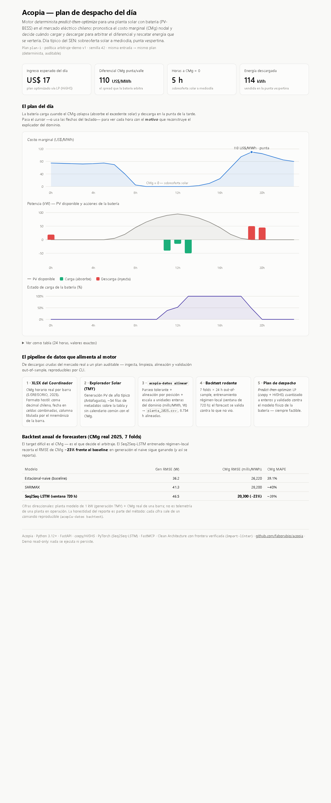

# Acopia

Motor de optimización de despacho para una planta solar con batería (PV-BESS) en el mercado eléctrico chileno: pronostica generación PV y **costo marginal (CMg)** nodal y decide cuándo **cargar/descargar** para arbitrar el diferencial de CMg y rescatar energía que se vertería por congestión. Núcleo **determinista predict-then-optimize** (auditable); DRL como modo opcional medido. Capa **MCP** read-only para interrogar y simular el plan.

> Arquitectura completa en [`SAD_Acopia_energia.md`](./SAD_Acopia_energia.md). Contexto de trabajo en [`CLAUDE.md`](./CLAUDE.md).

## Estado

**Fases 0–4 cerradas — el alcance de portafolio del SAD está completo** (sign-offs en [`docs/AUDIT.md`](./docs/AUDIT.md)):

- **F0 — Scaffolding:** capas Clean Architecture, value objects enteros, `ModeloBateria` puro, property-tests (determinismo y factibilidad).
- **F1 — Despacho determinista:** optimizador predict-then-optimize (cvxpy + HIGHS) que genera un plan **factible y rentable** con ingreso auditable; API REST.
- **F2 — Forecaster + escenarios:** estacional-naïve, SARIMAX y **Seq2Seq-LSTM** con escenarios probabilísticos deterministas; snapshot as-seen del forecast (huella SHA-256); pipeline de ingesta de datos chilenos reales.
- **F3 — Robustez + backtest:** optimizador **estocástico de dos etapas**, backtest de política contra el día real (esperado vs realizado vs foresight) y reoptimización intradía. Sobre CMg real 2025: el LSTM régimen-local pronostica CMg con **−23% RMSE vs naive**; 5 escenarios capturan ~100% del foresight.
- **F4 — Co-optimización SSCC + capa MCP + modo DRL:** arbitraje + **reserva de frecuencia** en una sola función objetivo (ADR-010), **servidor MCP read-only** para interrogar y simular el plan, y **modo DRL (PPO)** medido contra el baseline (ADR-005): captura el **96%** del óptimo determinista en días reales — y el experimento destapó (y pagó) una debilidad de la cuantización del LP (+8.9% de ingreso del baseline).

```bash
uv run uvicorn acopia.interfaces.rest.app:app --reload   # API en http://127.0.0.1:8000/docs
python -m acopia.interfaces.mcp.servidor                 # servidor MCP (stdio) con demo sembrada
```

La capa MCP expone `consultar_despacho`, `explicar_despacho` ("¿por qué cargaste a mediodía?")
y `simular` ("¿y si el CMg colapsa en la punta?") — solo lectura y simulación, nada se ejecuta
ni persiste.

## Dashboard demo

Con la API arriba, **`http://127.0.0.1:8000/demo`** sirve el dashboard del día típico
chileno (ADR-011): el plan de despacho sobre la duck curve (CMg, PV, acciones de la
batería y SoC, con el **motivo** de cada decisión en el tooltip) y el pipeline de datos
que alimenta al motor. HTML autocontenido — sin CDN, sin framework de frontend, legible
sin JavaScript (KPIs y tabla server-side), modo claro/oscuro. Es el mismo día sembrado
que interroga la demo MCP.



## Estructura

```text
src/acopia/
├── domain/          # núcleo puro (stdlib-only): value objects, entidades, servicios, puertos
├── application/     # casos de uso (fase 1+)
├── infrastructure/  # adaptadores: forecaster, solver, repos, gateways (fase 1+)
└── interfaces/      # REST (FastAPI) y MCP (FastMCP) (fase 1+)
tests/               # pytest + hypothesis
```

## Desarrollo

Requiere Python 3.12+ y [uv](https://docs.astral.sh/uv/).

```bash
uv venv
uv pip install -e ".[dev]"

uv run ruff check .          # lint
uv run mypy                  # tipado estricto
uv run lint-imports          # fronteras de arquitectura (import-linter)
uv run pytest                # tests
uv run pip-audit             # vulnerabilidades conocidas en dependencias
```

Extras opcionales: `.[forecasting]` (torch CPU, LSTM), `.[ingesta]` (openpyxl, XLSX del
Coordinador), `.[mcp]` (FastMCP, servidor MCP).

Base de datos (TimescaleDB) para fases posteriores:

```bash
docker compose up -d db
```

## Datos reales (Chile)

El motor consume una serie horaria `timestamp,generacion_w,cmg_mills_por_mwh`
(la "planta modelo"), que se arma de dos fuentes:

1. **CMg por barra — Coordinador Eléctrico.** Vía práctica: **descargar el XLS**
   de [Costo Marginal Real](https://www.coordinador.cl/mercados/documentos/transferencias-economicas/costo-marginal-real/)
   filtrando una barra y un rango de fechas, y guardarlo como CSV.
   *(La API existe — `costo-marginal-online/v4/findByDate`, ver `MEMORY.md` — pero
   no filtra por barra y está rate-limited: inviable para bajar un año de una barra.)*
2. **Generación PV — Explorador Solar** ([solar.minenergia.cl](https://solar.minenergia.cl/exploracion)):
   exportar la serie horaria de generación de la ubicación de la planta -> `gen.csv`.

Como el Explorador es un "año típico" (2004–2016) y el CMg es de otro año, **no
comparten calendario**: se alinean **por posición** (hora a hora), con el timestamp del CMg:

```bash
acopia-datos alinear --por-posicion \
  --cmg cmg.csv --col-cmg "Costo Marginal [USD/MWh]" \
  --generacion gen.csv --col-gen generacion_kw --escala-gen 1000 \
  --salida planta.csv
```

Los lectores toleran **coma decimal chilena** (`"57,79"`). Luego
`GatewayCSV("planta.csv").cargar()` entrega la serie de `Observacion` que alimenta
el forecaster y el despacho.

Con la planta modelo armada, los backtests reproducibles:

```bash
acopia-datos backtest --planta datos/planta.csv --folds 5 \
  --modelos naive,sarimax,lstm --ventana-entrenamiento 720   # error de forecast por modelo
acopia-datos backtest-politica --planta datos/planta.csv     # ingreso esperado vs realizado vs foresight
acopia-datos comparar-modos --planta datos/planta.csv        # ADR-005: DRL (PPO) vs baseline LP
```
