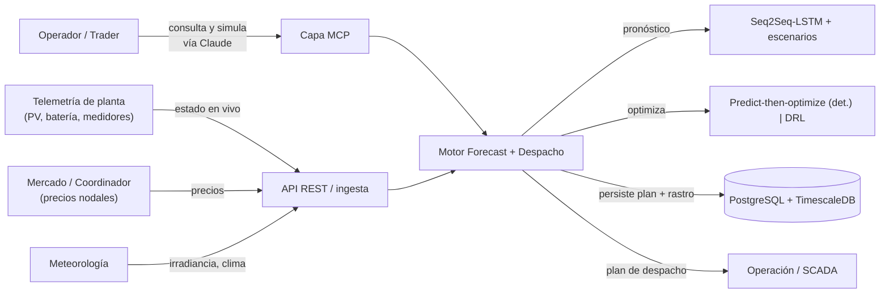
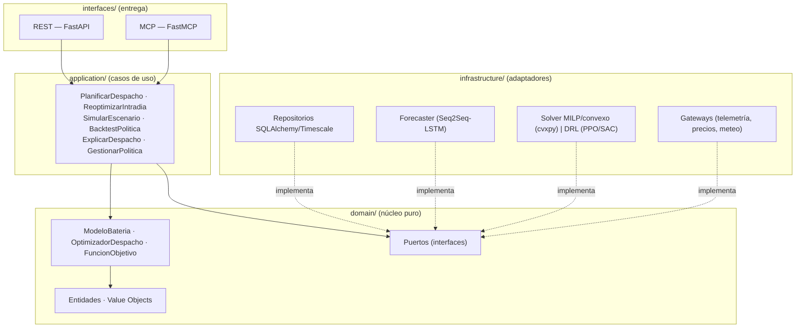
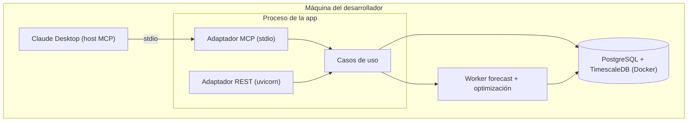

# SAD — Acopia · Motor de Optimización de Despacho Solar + Batería (PV-BESS) + Capa MCP

> **Documento de Arquitectura de Software (Software Architecture Document)**
> Estructura: arc42 · **Versión: 1.3.0** (historial al final) · Estado: alcance de portafolio completo — fases 0–4 cerradas (sign-offs en [`docs/AUDIT.md`](./docs/AUDIT.md)); fase 5 solo con tracción; en curso: Observatorio (ADR-012), la cara pública
> Proyecto: **Acopia** (identificador técnico: `acopia`) · *(de "acopio" = almacenamiento; reemplaza a "Ergia", descartado por colisión con Ergia.ai y cercanía fonética con ENGIE en el mercado chileno. Verificado sin colisión obvia en energía; pendiente confirmar dominios .ai/.cl e INAPI)*
> Hub de contexto: ver [`CLAUDE.md`](./CLAUDE.md) y [`MEMORY.md`](./MEMORY.md)
> Origen: *"Integrated forecasting and deep reinforcement learning for price-based self-scheduling of PV-BESS: Utility-scale evidence in Chile"* (Pérez, Lobos, Bonacic; U. de Los Andes, PLOS ONE 2026). Combina **forecasting Seq2Seq-LSTM** con control: un baseline **determinista predict-then-optimize** (el núcleo auditable) y **DRL (PPO/SAC)** como capa avanzada.
> Contexto de mercado: en 2025 Chile vertió **6.084 GWh de renovables** (curtailment), +7,8 % vs 2024, por congestión de transmisión y sobreoferta solar de mediodía. Entre **ene-2022 y may-2025 se vertieron ~11.900 GWh, ≈ US$562 millones** en ingresos perdidos. Sin las baterías ya operativas, el vertimiento de 2025 habría llegado a ~8 TWh — es decir, **el BESS ya está conteniendo el problema y Chile vive un boom de baterías**. Acopia ataca exactamente ese frente: decidir *cuándo cargar y descargar* una planta PV+batería para arbitrar el CMg y rescatar energía que se vertería. *(Fuentes: Coordinador Eléctrico Nacional vía Reporte Minero/ACERA; estimación de pérdidas vía Ember. Verificar cifra al actualizar el doc.)*
> Ecosistema: nueva **vertical energía**. Apalanca el stack event-driven del autor (Atalaya = telemetría) y su molde de optimización (Movinta/Riesgora).

---

## Tabla de contenido

1. [Introducción y objetivos](#1-introducción-y-objetivos)
2. [Restricciones](#2-restricciones)
3. [Contexto y alcance](#3-contexto-y-alcance)
4. [Estrategia de solución](#4-estrategia-de-solución)
5. [Vista de bloques de construcción](#5-vista-de-bloques-de-construcción)
6. [Vista de ejecución (runtime)](#6-vista-de-ejecución-runtime)
7. [Vista de despliegue](#7-vista-de-despliegue)
8. [Conceptos transversales](#8-conceptos-transversales)
9. [Decisiones de arquitectura (ADRs)](#9-decisiones-de-arquitectura-adrs)
10. [Requisitos de calidad](#10-requisitos-de-calidad)
11. [Riesgos y deuda técnica](#11-riesgos-y-deuda-técnica)
12. [Sistema de documentación viva](#12-sistema-de-documentación-viva)
13. [Hoja de ruta por fases](#13-hoja-de-ruta-por-fases)
14. [Glosario](#14-glosario)

---

## 1. Introducción y objetivos

### 1.1 Qué es esto

Un **motor de optimización de despacho** para una planta solar con batería (PV-BESS): el **cerebro de despacho auditable que se sienta entre el SCADA de la planta y el mercado eléctrico**. Dado el pronóstico de generación solar y de **costo marginal (CMg)** nodal, decide en cada intervalo cuánto **cargar, descargar o retener** energía, respetando las restricciones físicas de la batería, para **arbitrar el diferencial de CMg** (cargar cuando el CMg es bajo o nulo —típicamente el mediodía solar— e inyectar en la punta de la tarde) y **monetizar energía que de otro modo se vertería por congestión de transmisión** (curtailment). Incluye una **capa MCP** para que un operador interrogue y simule el plan de despacho en lenguaje natural ("¿por qué cargaste a mediodía?", "simulá un día con CMg cero al mediodía").

> **Precisión de dominio (importante):** el SEN chileno es un mercado de **despacho económico centralizado por costos auditados**, no de ofertas por precio (no es ERCOT/PJM). La planta no "vende a un precio que oferta": el **CMg** lo determina el modelo de programación del Coordinador Eléctrico Nacional, y el almacenamiento monetiza el **diferencial de CMg** entre horas. Por eso Acopia *pronostica CMg* (no un precio de oferta) y *optimiza arbitraje físico*, no trading. Ver [§3.0](#30-modelo-de-mercado-eléctrico-chile--premisa-de-dominio).

Combina dos núcleos, igual que el paper de referencia:

- **Pronóstico (forecasting):** un modelo Seq2Seq-LSTM proyecta generación PV y precios nodales, con generación de escenarios probabilísticos (la incertidumbre es parte del producto, no se esconde).
- **Optimización del despacho:** un núcleo **determinista predict-then-optimize** (forecast → optimización con restricciones) que es reproducible y auditable, con **DRL (PPO/SAC)** como modo avanzado que mejora el ingreso a cambio de menor interpretabilidad.

### 1.2 Objetivos de calidad principales

| Prioridad | Atributo | Por qué es crítico aquí |
|-----------|----------|--------------------------|
| 1 | **Reproducibilidad / Determinismo** | Justificar un despacho ante el Coordinador Eléctrico y auditar resultados exige reconstruir la decisión idéntica. El núcleo determinista lo garantiza. |
| 2 | **Calidad del pronóstico** | Todo el valor depende de predecir bien generación y precios; el error de forecast se mide y se reporta. |
| 3 | **Respeto de restricciones físicas** | Un plan que viole el estado de carga, la potencia o degrade la batería es inoperable y costoso. |
| 4 | **Explicabilidad** | El operador debe entender por qué el motor carga/descarga; es lo que la capa MCP expone. |
| 5 | **Robustez ante incertidumbre** | El plan debe comportarse bien bajo escenarios adversos (colapso de precios de mediodía), no solo en el caso medio. |

> **Nota de diseño (criterio senior):** la decisión que define el proyecto es **qué manda: el determinismo o el DRL.** El paper muestra que el DRL gana en ingreso, pero un operador regulado necesita defender sus decisiones. Por eso el **núcleo es predict-then-optimize determinista** (forecast + optimización con restricciones, reproducible y auditable), y el **DRL es un modo opcional** que se compara siempre contra ese baseline. Es el mismo patrón de Movinta: un motor auditable primero, lo sofisticado encima y medido.

### 1.3 Stakeholders

| Rol | Interés en la arquitectura |
|-----|----------------------------|
| Operador de planta / Trader de energía | Plan de despacho rentable, defendible y ajustable; consume la capa MCP. |
| Coordinador / Regulador | Decisiones trazables y reproducibles. |
| Inversor del activo | Maximizar ingreso del PV-BESS y reducir curtailment. |
| Operaciones (telemetría) | Que el plan se nutra del estado real de la planta y la batería. |
| Autor (portafolio) | Demostrar madurez senior: forecasting, optimización con restricciones, event-driven, IA/MCP. |

---

## 2. Restricciones

### 2.1 Técnicas

- **Lenguaje:** Python 3.12+ (alineado al stack del autor; ecosistema de forecasting/optimización maduro).
- **Forecasting:** Seq2Seq-LSTM (PyTorch) o librerías especializadas; generación de escenarios probabilísticos.
- **Optimización:** **cvxpy/Pyomo + solver (MILP/convexo)** para el predict-then-optimize determinista; **DRL (stable-baselines3, PPO/SAC)** como modo avanzado, en infraestructura.
- **Tipado y validación:** Pydantic v2 en `application/`/`infrastructure/`/`interfaces/`. **`domain/` stdlib-only** (modelo de batería, restricciones y función objetivo son puros).
- **Web framework:** FastAPI. **MCP:** FastMCP (stdio local; HTTP + OAuth 2.1 remoto).
- **Persistencia:** SQLAlchemy 2.0 + PostgreSQL + **TimescaleDB** (series temporales de generación/precio/telemetría).
- **Inyección de dependencias:** `injector`. **Contenedores:** Docker. **Toolchain:** uv · ruff · mypy --strict · import-linter.

### 2.2 Organizativas / de proceso

- **Presupuesto bajo:** versión portafolio en ~USD 0 (local + datos públicos del Coordinador Eléctrico Nacional de Chile + fixtures).
- **Metodología:** Specification-Driven Development.
- **Continuidad de contexto entre sesiones de IA** mediante documentación viva (§12).

### 2.3 Convenciones

- Idioma del dominio en **español** (Planta, Bateria, Despacho, Estado de Carga, Precio, Escenario); técnico en inglés cuando es idiomático.
- **El núcleo de optimización es determinista:** mismo forecast + misma política + misma semilla → mismo plan.
- **El forecast se entrega con su incertidumbre** (escenarios/intervalos); nunca un único número sin banda.
- La **energía y los precios** se modelan en unidades enteras (Wh, mills) donde el determinismo lo exija.

---

## 3. Contexto y alcance

### 3.0 Modelo de mercado eléctrico (Chile) — premisa de dominio

> Esta subsección fija el marco de mercado sobre el que se construye todo el motor. Sin esto, las decisiones de despacho carecen de sentido económico.

**Cómo funciona el mercado (SEN):** el Sistema Eléctrico Nacional, operado por el **Coordinador Eléctrico Nacional (CEN)**, opera bajo **despacho económico centralizado basado en costos variables auditados** — no es un mercado de ofertas por precio. El precio spot es el **costo marginal (CMg)** en cada barra/nodo, resultado del modelo de programación del Coordinador, y depende de hidrología, disponibilidad de gas, demanda y **congestión de transmisión** (el desacople norte–centro es la causa estructural del vertimiento solar). Implicancia para Acopia: **se pronostica y arbitra el CMg; no se oferta cantidad a un precio.**

**Marco regulatorio del almacenamiento:** la **Ley 21.505 (2022)** habilitó el almacenamiento *stand-alone* y su remuneración, abriendo el caso de negocio que Acopia optimiza.

**Flujos de ingreso de un BESS en Chile (revenue stacking):**

| Flujo | Qué es | Alcance |
|-------|--------|---------|
| **Arbitraje de energía** | Cargar con CMg bajo/nulo, inyectar con CMg alto | **Núcleo (fases 1–3)** |
| **Servicios complementarios (SSCC)** | Control de frecuencia (CPF/CSF), reservas; Reglamento de SSCC | **Co-optimizado en el MVP (fase 4)** |
| **Potencia de suficiencia** | Pago por capacidad firme | Extensión (§13, fase 5) — horizonte y modelado distintos |

> **Decisión de alcance:** el MVP **co-optimiza arbitraje + SSCC en una sola función objetivo**, porque es donde la economía del BESS realmente cierra y se hace bancable: capturar el diferencial de CMg *y* la remuneración por reserva/frecuencia compitiendo por la misma energía y potencia es el problema interesante (y honesto). Modelar SSCC implica que la **`PoliticaDeDespacho`** lleve también la asignación de potencia/energía reservada a cada producto de SSCC y sus restricciones (banda de reserva, tiempo de respuesta). La **potencia de suficiencia** queda en fase 5 porque su horizonte (capacidad firme anual) y su modelado son distintos del despacho intradía.

### 3.1 Contexto de negocio



### 3.2 Alcance funcional (qué SÍ hace)

- Ingerir series de generación PV, **CMg nodal**, meteorología y estado de batería.
- **Pronosticar** generación y CMg con incertidumbre (escenarios probabilísticos).
- **Optimizar el despacho** (cargar/descargar/retener para arbitrar el diferencial de CMg) respetando las restricciones de la batería, con núcleo determinista.
- Ofrecer un **modo DRL** avanzado, siempre comparado contra el baseline determinista.
- Versionar la **PoliticaDeDespacho** (restricciones de batería, objetivo, horizonte) de forma inmutable.
- **Reoptimizar** intradía ante desvíos del forecast (apalanca telemetría).
- Hacer **backtesting** de una política sobre histórico.
- Exponer consulta, explicación y simulación —en modo lectura/simulación— vía MCP.

### 3.3 Fuera de alcance (explícito)

- **No opera físicamente la planta** (no es el SCADA): produce el plan; la ejecución es del sistema de control.
- No es una fuente de datos de mercado ni de meteorología; los consume.
- No hace trading financiero de derivados; optimiza el despacho físico del activo.
- No gestiona el mantenimiento de la planta.
- **No remunera potencia de suficiencia en el MVP** (ver §3.0): el MVP co-optimiza arbitraje + SSCC; la potencia firme anual es extensión de roadmap (§13, fase 5). Las fases 1–3 son arbitraje puro; SSCC entra en fase 4.

---

## 4. Estrategia de solución

| Objetivo de calidad | Enfoque arquitectónico |
|---------------------|------------------------|
| Determinismo | Núcleo **predict-then-optimize**: forecast + optimización con restricciones, reproducible; property-test. (ADR-001, ADR-006) |
| Calidad de pronóstico | **Seq2Seq-LSTM** + escenarios probabilísticos detrás de un `PuertoForecaster`; baseline SARIMAX para comparar. (ADR-002) |
| Restricciones físicas | Modelo de batería (SoC, potencia, eficiencia, degradación) en el **dominio puro**; el optimizador las respeta como duras. (ADR-003) |
| Robustez | **Programación estocástica** (MILP de dos etapas sobre escenarios, no solo el caso medio); el modo DRL aprende política contracíclica. (ADR-004) |
| Modo avanzado | **DRL (PPO/SAC)** detrás del mismo `PuertoOptimizador`, siempre medido contra el baseline determinista. (ADR-005) |
| Reproducibilidad estable | La **PoliticaDeDespacho versionada** lleva la semántica; el motor es estable. (ADR-008) |
| Auditabilidad | **Snapshot** de forecast/precios/estado as-seen + rastro del plan. (ADR-007) |
| Integración con la suite | Telemetría por puerto (estilo Atalaya); precios/meteo por gateways. (ADR-009) |

> Idea fuerza: **si el modelo de batería + el optimizador determinista + el forecaster están bien hechos, la capa MCP y el modo DRL son extensiones.** El valor difícil está en pronosticar bien y en respetar la física de la batería de forma auditable.

---

## 5. Vista de bloques de construcción

### 5.1 Nivel 1 — Capas (Clean Architecture)



> **Frontera dura:** el `domain/` define **el modelo físico de la batería (SoC, potencia, eficiencia, degradación), las restricciones y la función objetivo del despacho** como estructuras puras, **sin PyTorch, sin cvxpy, sin DRL en las firmas**. El **forecaster, el solver y el agente DRL viven en `infrastructure/`** detrás de `PuertoForecaster` y `PuertoOptimizador`. El forecast entra al optimizador como **dato (escenarios)**, no como una llamada. Así el modelo de batería es testeable sin GPU ni solver, y el modo (determinista/DRL) es intercambiable. Blindada con `import-linter`.

### 5.2 Nivel 2 — Módulos del dominio

```text
domain/
├── value_objects/
│   ├── energia.py           # Wh enteros
│   ├── potencia.py          # W enteros
│   ├── precio.py            # precio nodal (mills enteros)
│   ├── soc.py               # estado de carga [0..1] discretizado
│   └── intervalo.py         # paso temporal del horizonte
├── entities/
│   ├── planta.py            # PV + batería + punto de conexión
│   ├── bateria.py           # capacidad, potencia, C-rate, eficiencia, ciclado, throughput de garantía
│   ├── escenario.py         # trayectoria de generación + precios (con probabilidad)
│   ├── plan_despacho.py     # acciones por intervalo (salida inmutable)
│   ├── politica_despacho.py # restricciones + objetivo + horizonte (UNIDAD versionada)
│   └── rastro.py            # RastroDespacho: forecast usado, escenarios, semilla
├── services/
│   ├── modelo_bateria.py    # dinámica de SoC y degradación (PURO)
│   ├── optimizador_despacho.py # define el problema de optimización (puro)
│   └── funcion_objetivo.py  # ingreso esperado (arbitraje CMg + SSCC) − penalización de ciclado/degradación
└── ports/
    ├── repositorio_planes.py
    ├── repositorio_politicas.py
    ├── puerto_forecaster.py     # Seq2Seq-LSTM + escenarios
    ├── puerto_optimizador.py    # MILP/convexo | DRL
    └── puerto_datos.py          # telemetría, precios, meteo
```

#### La política lleva la semántica, no el código

Como en Movinta/Riesgora, la **`PoliticaDeDespacho` versionada** fija restricciones, objetivo y horizonte; el motor es estable. Reproducir un plan = fijar (política, forecast as-seen, semilla):

```text
PoliticaDeDespacho  (UNIDAD ATÓMICA versionada e inmutable)
├── id / version
├── restricciones_bateria: { capacidad, potencia_max, c_rate_max, eficiencia, soc_min/max, max_ciclos_dia, throughput_garantia (energía total en vida útil) }
├── objetivo: MAX_INGRESO | MIN_CURTAILMENT | HIBRIDO(pesos)   # MAX_INGRESO co-optimiza arbitraje + SSCC
├── productos_sscc: [ { producto: CPF|CSF|RESERVA, banda_potencia, tiempo_respuesta, precio_esperado } ]
├── horizonte: { intervalos, resolución (ej. 15 min) }
├── modo: PREDICT_THEN_OPTIMIZE | DRL
└── semilla: int
```

### 5.3 Capa MCP — herramientas expuestas

| Herramienta MCP | Caso de uso que envuelve | Modo |
|-----------------|--------------------------|------|
| `consultar_despacho(plan_id)` | ConsultarDespacho | lectura |
| `explicar_despacho(plan_id, intervalo)` | ExplicarDespacho (por qué cargó/vendió) | lectura |
| `comparar_modos(plan_id)` | determinista vs DRL | lectura |
| `simular_escenario(politica|precios|generacion)` | SimularEscenario / Backtest | simulación (sin efectos) |

> **Decisión de seguridad:** la capa MCP es **read-only + simulación**. No envía órdenes al SCADA ni activa un plan real por NL.

---

## 6. Vista de ejecución (runtime)

### 6.1 Planificación de despacho (día siguiente)

```mermaid
sequenceDiagram
    participant O as Origen (REST/MCP)
    participant UC as PlanificarDespacho
    participant D as PuertoDatos
    participant F as PuertoForecaster (LSTM)
    participant M as ModeloBateria (puro)
    participant Opt as PuertoOptimizador
    participant DB as Repositorio
    O->>UC: planta + fecha + política + semilla
    UC->>DB: FIJAR PoliticaDeDespacho (versión X)
    UC->>D: histórico + estado actual de batería
    UC->>F: pronóstico de generación + precios (con escenarios)
    UC->>Opt: optimizar(escenarios, modelo batería, política X)
    Opt->>M: evaluar factibilidad (SoC, potencia)
    Opt-->>UC: plan de despacho por intervalo
    UC->>DB: persistir(Plan, Rastro, SNAPSHOT forecast+precios+estado, versión X, semilla)
    UC-->>O: plan + ingreso esperado + bandas de incertidumbre
```

Dos pasos críticos (estilo Movinta/Veredicto): **fijar la versión de política** y **persistir el snapshot** del forecast y el estado as-seen — sin eso, el backtest y la simulación no son fieles (ADR-007).

### 6.2 Reoptimización intradía

Cuando la telemetría muestra que la generación real se desvía del forecast, `ReoptimizarIntradia` recalcula el plan para el resto del día con el estado real de la batería. **Apalanca la infraestructura event-driven** (estilo Atalaya): el estado llega como eventos, no por polling.

> **Límite honesto (fase portafolio):** el Coordinador publica CMg (real y programado) y generación **agregada**, e irradiancia vía Explorador Solar — pero la **telemetría plant-level real (generación PV y estado de batería de *una* planta) no es pública.** En portafolio, la reoptimización intradía se demuestra con una **planta modelo sintética / proxy** que reproduce desvíos realistas. La capacidad arquitectónica (puerto de telemetría event-driven) queda lista; la demostración con datos reales de planta es fase posterior con un activo real.

### 6.3 Simulación / backtesting

Reusa el **snapshot guardado**: reevalúa una política sobre un día histórico (otro objetivo, otra batería, otro modo) y reporta ingreso, ciclos de batería, energía no vertida y comparación determinista-vs-DRL. **Límite honesto:** el backtest asume que las órdenes se habrían ejecutado; los desvíos de ejecución real se documentan.

---

## 7. Vista de despliegue

### 7.1 Fase local (portafolio, ~USD 0)



> El forecast (LSTM) y la optimización corren en un worker fuera del request. Datos públicos del Coordinador Eléctrico Nacional. En nube: ingesta event-driven real (Pub/Sub) y workers autoescalados.

---

## 8. Conceptos transversales

- **Incertidumbre explícita:** todo forecast lleva su banda/escenarios; todo plan, su ingreso esperado con dispersión. Es el equivalente del "rastro" de Veredicto.
- **Salud de la batería:** la degradación/ciclado se modela como costo, no se ignora; un plan que "gana" destruyendo la batería no es óptimo.
- **Observabilidad:** error de forecast (RMSE/MAPE), ingreso realizado vs esperado, ciclos, energía vertida evitada.
- **Series temporales:** TimescaleDB para telemetría y precios; retención y downsampling explícitos.

---

## 9. Decisiones de arquitectura (ADRs)

**ADR-001 — Núcleo predict-then-optimize determinista.** *Contexto:* decisiones de despacho deben ser defendibles ante el regulador. *Consecuencia:* reproducibilidad y auditabilidad; el DRL no es el árbitro.

**ADR-002 — Seq2Seq-LSTM + escenarios, con baseline SARIMAX.** *Consecuencia:* mejor precisión y comparación honesta. *Nota:* el ~34% menos RMSE es lo que **el paper de referencia reporta sobre su dataset**, no una promesa sobre nuestros datos; el objetivo verificable es "batir a SARIMAX en nuestro set", no replicar ese número. *Riesgo de dominio:* el CMg es fuertemente **régimen-dependiente** (hidrología, gas, congestión); un año seco cambia la estructura del precio, por lo que el forecast debe re-evaluarse por régimen y no asumir estacionariedad.
> **Enmienda ADR-002.1 (2026-07-09) — entrenamiento régimen-local.** El riesgo anticipado se **confirmó empíricamente** en F2–F3 sobre datos reales (CMg S.GREGORIO 2025): el LSTM con hiperparámetros fijos gana en enero (−36% CMg RMSE vs naive) pero **pierde en el backtest anual** con historial completo (38.9k vs 26.2k). La decisión: los forecasters entrenan **régimen-local** con una ventana deslizante de historia (`ventana_entrenamiento`, hoy 720 obs = 30 días), no con todo el histórico. Evidencia (anual, 7 folds): LSTM CMg RMSE **20.3k vs 26.2k naive (−23%)**; SARIMAX pasa de impráctico a segundos. *Trade-off aceptado:* la ventana 720 replica la config ganadora de enero y **no fue barrida sistemáticamente** (AUD-005); en generación PV el naive sigue ganando. Detalle en `docs/AUDIT.md` (cierre F3) y `docs/CASES.md` (régimen-dependencia).
> **Enmienda ADR-002.2 (2026-07-12) — sweep de la ventana ejecutado: 720 confirmada.** El barrido pendiente de AUD-005 corrió con el mismo protocolo del anual (7 folds × 24 h, `planta_2025.csv`, LSTM 48/32/250, semilla 0). CMg RMSE por ventana: 168→**32.7k** · 336→**20.4k** · 720→**20.3k** · 1440→**21.7k** · 2160→**21.5k** · 4320→**36.3k** (referencias: naive 26.2k, historial completo 38.9k). Lectura: **720 es el mínimo**, dentro de una **meseta amplia 336–2160** que bate al naive completa (−17% a −23%) — la elección no es frágil —, con degradación clara en los extremos (168: muy poca historia para aprender; ≥4320: el cambio de régimen diluye el patrón reciente). La curva completa reemplaza a los dos puntos de ADR-002.1 como evidencia de la régimen-dependencia. Sigue viva en AUD-005 la parte de hiperparámetros del modelo y la regla de selección de ventana por régimen (hidrología/estación).

**ADR-003 — Modelo físico de batería en el dominio puro.** *Contexto:* además de SoC/potencia/eficiencia se modelan **C-rate** y **throughput de garantía** (cap de energía total en vida útil), que es lo que de verdad limita el ciclado de un BESS real más que un "max ciclos/día". Degradación tratada como costo. *Consecuencia:* restricciones duras respetadas y testeables sin solver; el plan no destruye la garantía de la batería.

**ADR-004 — Programación estocástica sobre escenarios, no solo el caso medio.** *Contexto:* formulación como MILP de dos etapas (decisión here-and-now + recurso por escenario). *Consecuencia:* robustez ante el colapso de CMg de mediodía. *Trade-off:* el costo computacional escala con el número de escenarios × intervalos; se acota el N de escenarios para respetar la latencia (§10).

**ADR-005 — DRL (PPO/SAC) como modo avanzado detrás del mismo puerto.** *Consecuencia:* mejor ingreso disponible, siempre medido contra el baseline; intercambiable. *Postura senior:* para arbitraje de **una** planta con buen forecast, un MILP bien planteado es casi óptimo y el DRL rara vez justifica la pérdida de interpretabilidad. Por eso el DRL es un **experimento de investigación, no un diferenciador de producto**; ante una audiencia regulada/integradora, confianza > novedad. Su valor real aparece en la co-optimización multi-ingreso y multi-activo (fase 5).

**ADR-006 — Optimización determinista con semilla explícita.** *Consecuencia:* reproducibilidad verificable por property-test.

**ADR-007 — Snapshot de forecast/precios/estado por plan.** *Consecuencia:* backtest y simulación fieles; auditoría reconstruible.
> **Enmienda ADR-007.1 (2026-07-09) — `RastroForecast` con huella SHA-256.** El snapshot del *plan* (`RastroDespacho`, F1) se complementa con la **procedencia reconstruible del pronóstico**: `RastroForecast` (dominio) captura forecaster (id/versión), horizonte, n_escenarios, semilla, n_observaciones y la **huella SHA-256 de la historia as-seen** (`domain/services/huella.py`, stdlib), junto a los escenarios producidos. `pronosticar_con_rastro` los emite atómicamente y `reproduce_el_rastro` permite a un auditor regenerar el forecast **bit a bit** con la misma historia + semilla. Implementado en F2 (2026-07-01); persistir ambos rastros juntos es deuda de la fase de persistencia (AUD-010).

**ADR-008 — PoliticaDeDespacho versionada; motor estable.** *Consecuencia:* fijar (política, forecast, semilla) reproduce el plan.

**ADR-009 — Telemetría/precios/meteo como puertos.** *Consecuencia:* Acopia es testeable aislada (gateways simulados) e integrable con infraestructura real (estilo Atalaya).

**ADR-010 — SSCC como un único producto: reserva de frecuencia por disponibilidad (2026-07-09).** *Contexto:* §3.0 dejó abierto si el MVP modela varios productos de SSCC (CPF/CSF/reservas, cada uno con banda y tiempo de respuesta) o uno solo. *Decisión:* el MVP co-optimiza **un** producto — `ReservaFrecuencia`: una **banda simétrica ±R** remunerada por **disponibilidad** a **precio constante fijado en la política** (`PoliticaDespacho.reserva: ReservaFrecuencia | None`; `None` = arbitraje puro). El LP le impone tres familias de restricciones: headroom de potencia (±R sobre el setpoint), energía para **sostener la activación el intervalo completo** (`energia − R/ef_d ≥ e_min`, `energia + ef_c·R ≤ e_max`) y factibilidad de inyección/retiro en el nodo **en todos los escenarios**. *Fuera del MVP:* el settlement de la activación real (la energía efectivamente entregada al activarse la banda) y la distinción CPF/CSF con tiempos de respuesta. *Por qué:* proporcionalidad — un producto basta para demostrar el problema interesante (la banda **compite** por la misma potencia y energía que el arbitraje, en una sola función objetivo) sin importar la burocracia tarifaria del Reglamento de SSCC; el esquema multi-producto de la política (§5.2) sigue siendo el destino si un activo real lo exige. *Consecuencia validada:* la co-optimización produce comportamientos emergentes correctos fijados por test (comprar energía de la red para vender disponibilidad; sin retiro de red, absorber exige estar inyectando ≥ R — ver `docs/CASES.md`).

**ADR-011 — Dashboard demo read-only autocontenido en la app REST (2026-07-12).** *Contexto:* el portafolio necesita **mostrar** el plan del día y el pipeline de datos (la vitrina "dashboards y reportes") sin agregar infraestructura. *Decisión:* `GET /demo` en la app FastAPI existente sirve un **reporte HTML/SVG/JS vanilla autocontenido** (sin CDN ni dependencias nuevas): KPIs y tabla renderizados server-side (legible sin JavaScript), gráficos SVG con crosshair/tooltip que exponen el `motivo` del `ExplicadorDespacho` por hora, modo claro/oscuro. Los datos salen del **día demo compartido** (`interfaces/demo_dia.py`): la misma duck curve sembrada que la demo stdio del MCP — una sola fuente, mismo plan. *Alternativas descartadas:* Streamlit/frontend SPA (framework y build para una sola vista — desproporcionado); página estática suelta (se desincroniza del motor: aquí el HTML se arma desde el plan optimizado real en cada arranque). *Consecuencia:* la demo es `uvicorn` + un navegador, read-only (nada persiste), y el reporte evoluciona con el dominio porque se genera desde sus entidades.

**ADR-012 — Observatorio: la cara pública de Acopia como sitio estático de datos del mercado (2026-07-14).** *Contexto:* el proyecto entró en exploración de salida real y el pendiente #1 pedía decidir cómo publicar la demo (snapshot estático vs app viva). En paralelo el autor propuso el enfoque **Observatorio**: los datos del mercado eléctrico chileno son públicos pero hostiles (XLSX con celdas combinadas y headers profundos, APIs con rate limit) y nadie los muestra bien; convertirlos en un tablero público es una cuña de posicionamiento — aprender el dominio construyendo, generar contenido encontrable por reclutadores y prospectos — y un artefacto de venta para la prospección PMGD (mostrarle a un candidato *su propio* vertimiento). *Evidencia (spike 2026-07-14):* el Coordinador publica **"Reducciones ERV"** — XLSX mensual con el curtailment **por central × hora × día**, separado solar/eólico/hidro, con ~2 meses de rezago (verificado sobre el archivo de mayo 2026: hojas `Resumen-DiarioHorario-*`, matriz Central/Hora 1–24; el mismo estilo hostil que el CMg ya domado en F2). El CMg histórico ya se obtiene por barra (XLS del Coordinador); la API de datos abiertos de la CNE (energiaabierta.cl) queda como fuente complementaria. *Decisión:* (1) el Observatorio **vive dentro de acopia** como superficie de interfaces (`interfaces/observatorio/`), reusando la ingesta existente (`leer_serie_xlsx`, `parsear_decimal`, matching tolerante); (2) genera un **sitio 100% estático** publicado en **GitHub Pages**, regenerado por un **GitHub Action mensual** cuando aparece el XLSX nuevo; (3) ese sitio es la **única cara pública** del proyecto e incluye el **snapshot estático del dashboard demo** (ADR-011) — la publicación de la demo queda resuelta sin app viva. Contenido v1: vertimiento por zona/tecnología, la duck curve del CMg y la valorización del vertimiento. *Nota de honestidad (regla del contenido):* el vertimiento ocurre justo cuando el CMg ≈ 0, así que "valorizado a spot" daría casi cero y sería un titular tramposo; lo que se publica es la valorización **del desplazamiento a la punta** (qué valdría esa energía almacenada y vendida cara) — deliberadamente, la tesis de Acopia contada con datos públicos. El rezago de ~2 meses de la fuente se declara en el sitio. *Alternativas descartadas:* repo nuevo (duplica la ingesta, divide la cara pública y pierde el vínculo motor↔datos; el rigor del repo se acota solo porque el observatorio es interfaces, no dominio); app viva en free tier (exige Dockerfile y proteger `POST /planes` — superficie de ataque y mantención sin beneficio para contenido de cadencia mensual). *Consecuencias:* costo e infraestructura cero, cero superficie de ataque; deuda nueva **AUD-026** (la valorización fina exige mapear central→barra; la v1 usa el CMg de una barra representativa por zona, limitación declarada).

---

## 10. Requisitos de calidad

| Atributo | Escenario | Métrica objetivo |
|----------|-----------|------------------|
| Reproducibilidad | (política, forecast, semilla) repetida | plan idéntico (property-test) |
| Pronóstico | CMg nodal día siguiente | RMSE mejor que SARIMAX en nuestro set (el ~34% es referencia del paper, no promesa) |
| Factibilidad | plan generado | 0 violaciones de SoC/potencia |
| Robustez | día con colapso de precios | comportamiento contracíclico, sin ciclado excesivo |
| Latencia | plan día siguiente (96 intervalos de 15 min) | < 60 s con N de escenarios acotado; la latencia escala con escenarios × intervalos (ADR-004) |

---

## 11. Riesgos y deuda técnica

| Riesgo | Impacto | Mitigación |
|--------|---------|------------|
| Forecast pobre arruina el despacho | Alto | Escenarios + reoptimización intradía; reportar incertidumbre (ADR-002, ADR-004) |
| DRL caja negra no defendible | Alto | Determinista como núcleo; DRL solo como modo medido (ADR-001, ADR-005) |
| Degradación de batería ignorada | Medio | Modelada como costo (ADR-003) |
| Cambios regulatorios del mercado eléctrico | Medio | Objetivo y restricciones como política versionada (ADR-008) |
| Calidad/latencia de datos de mercado | Medio | Gateways robustos; validación; fallback a último dato bueno |

**Deuda aceptada en el MVP:** una planta modelo, datos públicos, sin integración SCADA real, DRL como experimento opcional. Documentado como fase posterior.

---

## 12. Sistema de documentación viva (modo de trabajo)

El proyecto se construye con **Specification-Driven Development (SDD)** y una **documentación viva** que mantiene la continuidad de contexto entre sesiones de IA. No es decoración: es el mecanismo por el que cada sesión arranca sabiendo dónde quedó la anterior y por el que cada decisión queda trazada.

### 12.1 El loop de trabajo (SDD)

Para cada unidad de trabajo (feature o fase):

```text
1. ESPECIFICAR  → se escribe/actualiza la spec en el SAD o en docs/ (qué y por qué, antes del código)
2. IMPLEMENTAR  → código que satisface la spec; el dominio primero, los adaptadores después
3. VERIFICAR    → tests (property-tests de determinismo y factibilidad incluidos)
4. AUDITAR      → entrada en docs/AUDIT.md con "Vista de halcón" (qué se hizo, qué quedó débil)
5. SIGN-OFF     → la fase no se cierra sin auditoría firmada; lo pendiente pasa a deuda/roadmap
```

> Regla dura: **la spec se actualiza antes que el código**, y **ninguna fase cierra sin su entrada en `AUDIT.md`** (§13).

### 12.2 Artefactos y cuándo se tocan

| Artefacto | Rol | Cuándo se actualiza |
|-----------|-----|---------------------|
| `SAD.md` (este doc) | **Fuente de verdad** de arquitectura | Ante cualquier cambio de arquitectura/ADR, *antes* de implementarlo |
| `CLAUDE.md` | **Hub de contexto**: cómo arranca una sesión, comandos, convenciones, punteros | Cuando cambia el modo de trabajo o entra una convención nueva |
| `MEMORY.md` | **Bitácora**: decisiones, hallazgos no obvios, estado actual | Al final de cada sesión y ante cada decisión relevante |
| `docs/AUDIT.md` | **Auditoría por fase** (Vista de halcón): incluye auditoría de forecast (RMSE/MAPE) y validación de factibilidad | Al cerrar cada fase (gate de sign-off) |
| `docs/CASES.md` | **Casos borde** del dominio: días sin sol, CMg negativo/cero, batería al límite, SoC mínimo | Al descubrir/cubrir un caso borde |
| `docs/TROUBLESHOOTING.md` | Problemas conocidos y su resolución | Al resolver un problema reproducible |
| `README.md` / `DEPLOY.md` | Onboarding y despliegue | Al cambiar setup o deploy |

### 12.3 Protocolo de continuidad entre sesiones de IA

Una sesión nueva **bootea su contexto en este orden**: `CLAUDE.md` (cómo trabajar aquí) → `MEMORY.md` (dónde quedamos) → `SAD.md` (la arquitectura) → el `docs/` relevante a la tarea. Cierra escribiendo en `MEMORY.md` el estado y la próxima acción. Así el contexto sobrevive al fin de la ventana de la IA.

> **Ventaja de ecosistema:** Acopia reusa el molde de optimización de Movinta (política versionada + snapshot + MCP) y la infraestructura event-driven de Atalaya para la telemetría. El esfuerzo nuevo es el modelo de batería, el forecaster y el optimizador de despacho.

---

## 13. Hoja de ruta por fases

Cada fase termina con auditoría en `AUDIT.md` y sign-off.

| Fase | Entregable | Demostrable |
|------|-----------|-------------|
| **0 — Scaffolding** | Capas, docs (§12), modelo de batería, Docker + Postgres/Timescale | Repo navegable, fronteras blindadas |
| **1 — Despacho determinista** | Optimizador predict-then-optimize con forecast dado + modelo de batería; REST; property-test | "Dado un forecast, genero un plan factible y rentable + por qué" |
| **2 — Forecaster + escenarios** | Seq2Seq-LSTM + escenarios probabilísticos; baseline SARIMAX; snapshot | "Pronostico generación y precios con incertidumbre" |
| **3 — Robustez + backtest** | Optimización sobre escenarios; backtest sobre histórico chileno; reoptimización intradía | "Valido la política sobre datos reales y reoptimizo ante desvíos" |
| **4 — Co-optimización SSCC + Capa MCP (MVP)** | **Co-optimización arbitraje + servicios complementarios** en una sola función objetivo (donde cierra la economía del BESS, §3.0); MCP read-only + simulación; modo DRL opcional medido contra el baseline | "Optimizo arbitraje y reserva de frecuencia juntos, y pregunto por qué cargó la batería" |
| **5 — Potencia + escala (opcional)** | **Potencia de suficiencia** (capacidad firme); integración event-driven real (estilo Atalaya); multi-planta; nube; DRL multi-activo | "Sumo el pago por capacidad y escalo a varias plantas" |

> **Recomendación de alcance:** fases 1–4 son el portafolio. Profundo y angosto: una planta PV-BESS chilena bien modelada, con forecast honesto y despacho auditable, le gana a un DRL impresionante pero indefendible.

---

## 14. Glosario

| Término | Definición |
|---------|------------|
| **PV-BESS** | Planta fotovoltaica (PV) con sistema de almacenamiento en baterías (BESS). |
| **Curtailment (vertimiento)** | Energía renovable que se deja de generar/inyectar porque la red no la absorbe. |
| **Self-scheduling** | Que la planta decide su propio despacho para maximizar ingreso según precios. |
| **Precio nodal / CMg** | Costo marginal de la energía en una barra/nodo específico (varía por congestión). En Chile lo determina el modelo de programación del Coordinador, no una oferta de la planta. |
| **Coordinador (CEN)** | Coordinador Eléctrico Nacional: opera el SEN bajo despacho centralizado por costos. |
| **SSCC** | Servicios complementarios (control de frecuencia, reservas); flujo de ingreso adicional del BESS. |
| **Ley 21.505 (2022)** | Ley chilena que habilitó el almacenamiento *stand-alone* y su remuneración. |
| **SoC (State of Charge)** | Estado de carga de la batería. |
| **Predict-then-optimize** | Pronosticar y luego optimizar con ese pronóstico como dato (determinista, auditable). |
| **DRL (PPO/SAC)** | Deep Reinforcement Learning: aprende una política de control (Proximal Policy Optimization / Soft Actor-Critic). |
| **Seq2Seq-LSTM** | Red recurrente secuencia-a-secuencia para pronóstico de series temporales. |
| **Escenario** | Una trayectoria posible de generación/precios, con su probabilidad. |
| **PoliticaDeDespacho** | Restricciones + objetivo + horizonte, versionado. Unidad atómica. |
| **MCP** | Model Context Protocol. |

---

## Historial de revisiones

> Regla del método: el SAD cambia **solo por ADR nuevo o enmienda versionada** — nunca por edición silenciosa.

| Versión | Fecha | Cambios |
|---|---|---|
| 0.1 | 2026-06-28 | Draft inicial arc42: contexto, capas Clean Architecture, ADR-001…009, roadmap de 6 fases. |
| 1.0.0 | 2026-06-28 | Endurecimiento "vista de halcón" pre-implementación: §3.0 (mercado chileno de despacho por costos, Ley 21.505, revenue stacking), SSCC co-optimizado entra al MVP (fase 4), cifras de curtailment verificadas, DRL reposicionado como experimento (ADR-005), C-rate + throughput de garantía en ADR-003, límites honestos de datos (§6.2, §6.3). Rename Ergia → Acopia. |
| 1.1.0 | 2026-07-09 | Alineación con el Método (MANIFIESTO v1.1.0): **ADR-010** (SSCC como producto único de reserva de frecuencia por disponibilidad), **enmienda ADR-002.1** (entrenamiento régimen-local, con la evidencia anual F3), **enmienda ADR-007.1** (`RastroForecast` + huella SHA-256), esta tabla de historial y actualización del estado del documento (fases 0–3 cerradas). |
| 1.2.0 | 2026-07-12 | **ADR-011** (dashboard demo read-only autocontenido en la app REST, `GET /demo`, día demo compartido con el MCP) + **enmienda ADR-002.2** (sweep de la ventana régimen-local ejecutado: 720 confirmada dentro de la meseta 336–2160; paga la parte de ventana de AUD-005). Header al día (fases 0–4 cerradas) y fix del texto del rename (decía "Acopia.ai" donde iba "Ergia.ai"). |
| 1.3.0 | 2026-07-14 | **ADR-012** (Observatorio: sitio estático de datos del mercado en GitHub Pages, dentro de acopia, regenerado por Action mensual; absorbe la publicación de la demo como snapshot de ADR-011; valorización honesta del vertimiento = desplazamiento a la punta, no spot). Evidencia del spike: XLSX "Reducciones ERV" del Coordinador (central × hora × día). Deuda nueva AUD-026. |

---

*Fin del SAD. Mantener sincronizado con `CLAUDE.md` ante cualquier cambio de arquitectura.*
